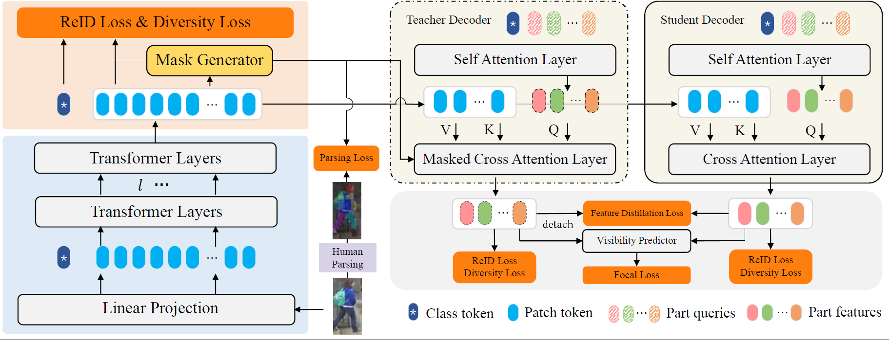

<!-- 
 -->

# [ICASSP 2024] Part Representation Learning with Teacher-Student Decoder for Occluded Person Re-identification

The *official* repository for [Part Representation Learning with Teacher-Student Decoder for Occluded Person Re-identification](https://pan.baidu.com/s/16RbxJOGRwHX6bLHlCFCyPw?pwd=ald6)


## Pipeline




## Requirements

### Installation

```bash
pip install -r requirements.txt
(we use /torch 1.7.0 /torchvision 0.7.0 /timm 0.3.2 /cuda 10.2 / 11G 2080ti or 24G 3090 for training and evaluation.
Note that we use torch.cuda.amp to accelerate speed of training which requires pytorch >=1.6)
```

### Prepare Datasets

```bash
mkdir data
```

Download the person datasets[DukeMTMC-reID](https://arxiv.org/abs/1609.01775),[Occluded-Duke](https://github.com/lightas/Occluded-DukeMTMC-Dataset), and Move the new dataset split file to the 'Occluded_Duke' folder. Download the human parsing labels provided by [bpbreid](https://github.com/VlSomers/bpbreid)
 on [GDrive](https://drive.google.com/drive/folders/1IbCAbjj3XtV3_tFOsCuqBi79ZiDqNc1H) 

```bash
mv new_gallery.txt data/Occluded_duke/
mv new_query.txt data/Occluded_duke/
```

```
data
├── dukemtmcreid
│   └── images ..
|   └── masks ..
├── Occluded_Duke
│   └── images ..
│   └── masks ..
|   └── new_gallery.txt
|   └── new_query.txt
```

### Prepare ViT Pre-trained Models

You need to download the ImageNet pretrained transformer model : [ViT-Base](https://github.com/rwightman/pytorch-image-models/releases/download/v0.1-vitjx/jx_vit_base_p16_224-80ecf9dd.pth), [ViT-Small](https://github.com/rwightman/pytorch-image-models/releases/download/v0.1-weights/vit_small_p16_224-15ec54c9.pth), [DeiT-Small](https://dl.fbaipublicfiles.com/deit/deit_small_distilled_patch16_224-649709d9.pth), [DeiT-Base](https://dl.fbaipublicfiles.com/deit/deit_base_distilled_patch16_224-df68dfff.pth)

## Training and Evaluation

We utilize 1  GPU for training.

```bash
sh run_tsd.sh
```

## Acknowledgement

Codebase from [TransReID](https://github.com/damo-cv/TransReID) , [bpbreid](https://github.com/VlSomers/bpbreid)

## Citation

If you find this code useful for your research, please cite our paper

```
@inproceedings{gao2024part,
  title={Part Representation Learning with Teacher-Student Decoder for Occluded Person Re-identification},
  author={Gao, Shang; Yu, Chenyang; Zhang, Pingping and Lu, Huchuan},
  booktitle={ICASSP},
  year={2024}
} 
```

## Contact

If you have any question, please feel free to contact us. E-mail: gs940601k@gmail.com

